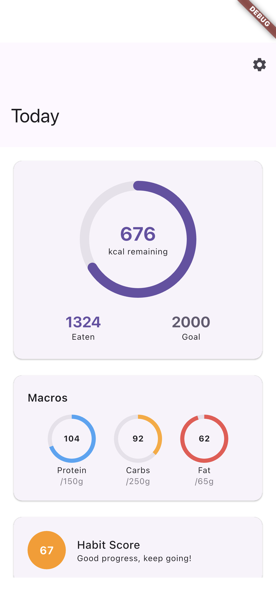
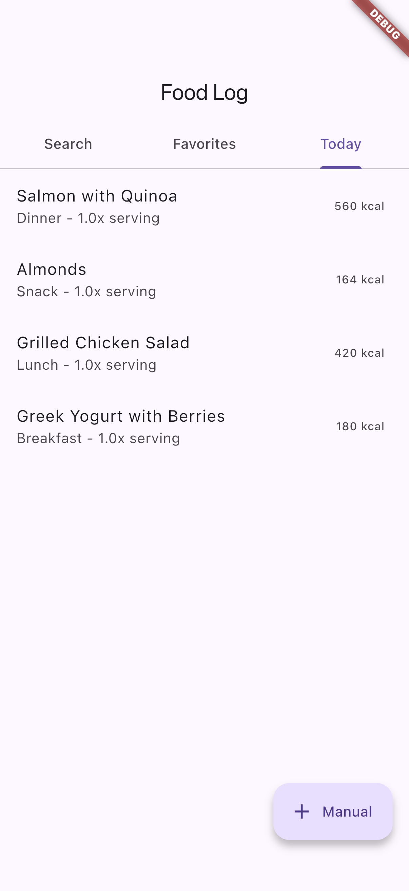
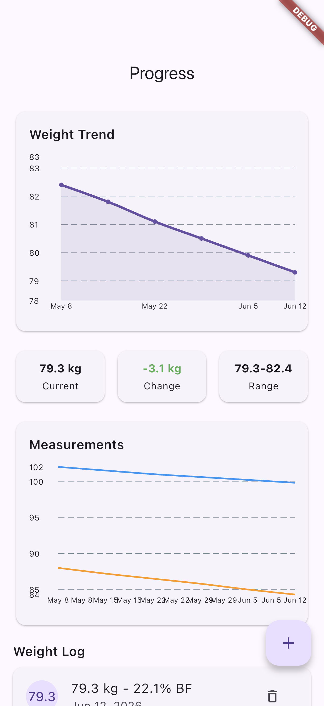
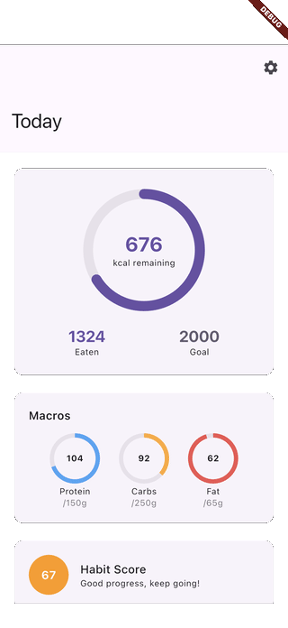

# flutter_nutrition_tracker

A nutrition and calorie tracker built with Flutter and Riverpod. It logs meals, tracks daily calories and macros against personal goals, plans weekly meals with an auto-generated grocery list, simulates barcode scanning for quick food lookup, and charts weight and body-measurement progress over time. Local data is persisted with Hive.

## Demo

These are real captures from the iOS Simulator, produced by an integration-test driver (no mockups). See [FLOW.md](FLOW.md) for how they are generated.

| Dashboard | Food Log | Progress |
| --- | --- | --- |
|  |  |  |

## Features

- Daily dashboard with calorie ring, protein/carbs/fat macro rings, and a habit score
- Food log with search, favorites, and a Today tab of logged meals
- Daily goals editor (calories and macros) persisted locally
- Weekly meal planning with grocery-list generation
- Simulated barcode scanning for product lookup (tap a sample product on the simulator, camera on device)
- Progress screen with a weight-trend line chart, body measurements, and stats

## Stack

- Flutter (Material 3)
- Riverpod for state management
- Hive for local persistence
- go_router for navigation
- fl_chart for charts
- freezed / json_serializable for models
